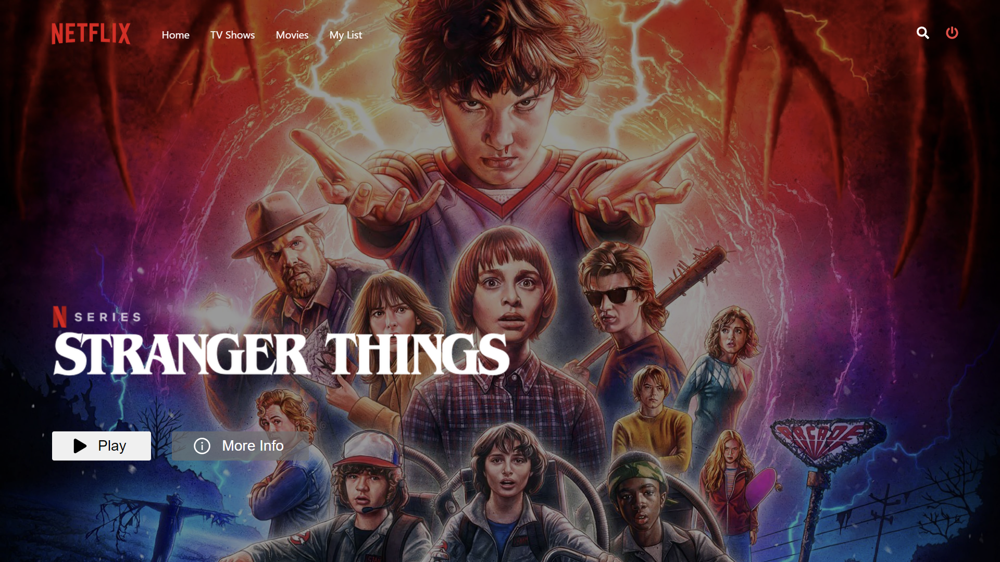
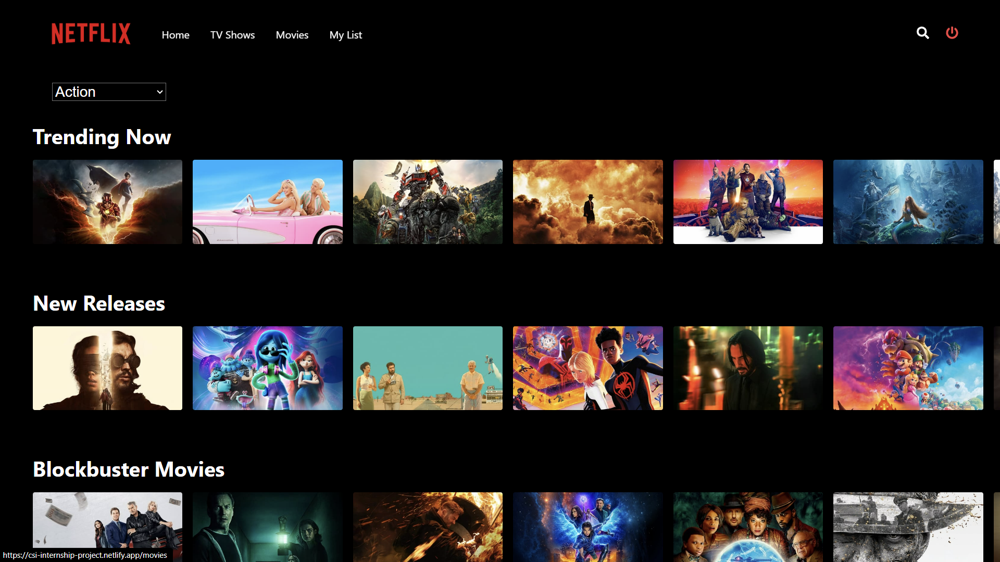
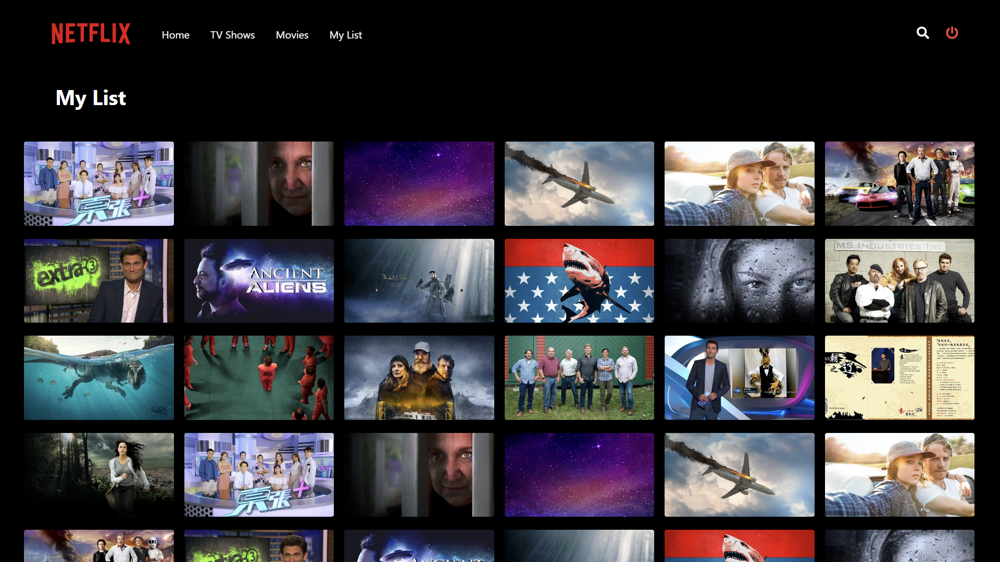

# CSI-Internship-Project-Netflix





## Table of Contents

- [CSI-Internship-Project-Netflix](#csi-internship-project-netflix)
  - [Table of Contents](#table-of-contents)
  - [Introduction](#introduction)
  - [Features](#features)
  - [Technologies Used](#technologies-used)
  - [Getting Started](#getting-started)
    - [Prerequisites](#prerequisites)
    - [Installation](#installation)
  - [Configuration](#configuration)
    - [Firebase Configuration:](#firebase-configuration)
    - [MongoDB Configuration:](#mongodb-configuration)
    - [Usage](#usage)
  - [Usage](#usage-1)
  - [API Endpoints](#api-endpoints)
  - [Contributing](#contributing)

## Introduction

This is a Netflix Clone project built using React, Redux Toolkit, Firebase, Styled Components, Axios, Node.js, Express, and MongoDB. The aim of this project is to replicate some of the core features of the Netflix platform, allowing users to browse and watch a collection of movies and TV shows.

## Features

- User authentication (Sign up, Sign in, Sign out) using Firebase authentication.
- Browse and search a collection of movies and TV shows.
- Watch movie trailers using embedded video players.
- Interactive and responsive user interface, replicating the Netflix design.
- Backend API to handle data retrieval and management.

## Technologies Used

- React: Frontend library for building user interfaces.
- Redux Toolkit: State management library for predictable state container.
- Firebase: Authentication and database management platform.
- Styled Components: Styling library for creating reusable styled elements.
- Axios: Promise-based HTTP client for making API requests.
- Node.js: JavaScript runtime for server-side development.
- Express: Web application framework for Node.js.
- MongoDB: NoSQL database for storing application data.

## Getting Started

### Prerequisites

Before running the project, make sure you have the following installed:

- Node.js (version X.X.X)
- npm (version X.X.X)
- MongoDB (Make sure MongoDB server is running)

### Installation

1. Clone the repository:

```bash
git clone https://github.com/diwakar1593/CSI-Internship-Project.git
cd CSI-Internship-Project
```

2. Install the frontend dependencies:
```bash
cd netflix-ui
npm install

```
3. Install the backend dependencies:
```bash
cd netflix-api
npm install

```

## Configuration

Before running the project, you need to configure Firebase and MongoDB:

### Firebase Configuration:

1. Go to the Firebase console (https://console.firebase.google.com/) and create a new project.

2. Obtain your Firebase Web API Key and replace it in the frontend configuration file (netflix-ui\src\utils\firebase-config.js).

3. Enable Firebase authentication with Email/Password as the sign-in method.

### MongoDB Configuration:

1. Ensure you have MongoDB installed and running on your system.

2. Replace the MongoDB connection URL in the backend configuration file (backend/config/db.js).


### Usage

1. Start the backend server:

```bash
cd netflix-api
npm start

```

2. Start the frontend development server:
```bash
cd netflix-ui
npm start

```

## Usage

Access the application in your web browser at http://localhost:3000/.

## API Endpoints

The backend server provides the following API endpoints:

- `GET /api/movies`: Get a list of all available movies.
- `GET /api/movies/:id`: Get details of a specific movie.
- `POST /api/movies`: Add a new movie (authentication required).
- `PUT /api/movies/:id`: Update details of a specific movie (authentication required).
- `DELETE /api/movies/:id`: Delete a specific movie (authentication required).
- `GET /api/shows`: Get a list of all available TV shows.
- `GET /api/shows/:id`: Get details of a specific TV show.
- `POST /api/shows`: Add a new TV show (authentication required).
- `PUT /api/shows/:id`: Update details of a specific TV show (authentication required).
- `DELETE /api/shows/:id`: Delete a specific TV show (authentication required).

## Contributing

Contributions are welcome! If you find any issues or want to enhance the project, feel free to create a pull request.
